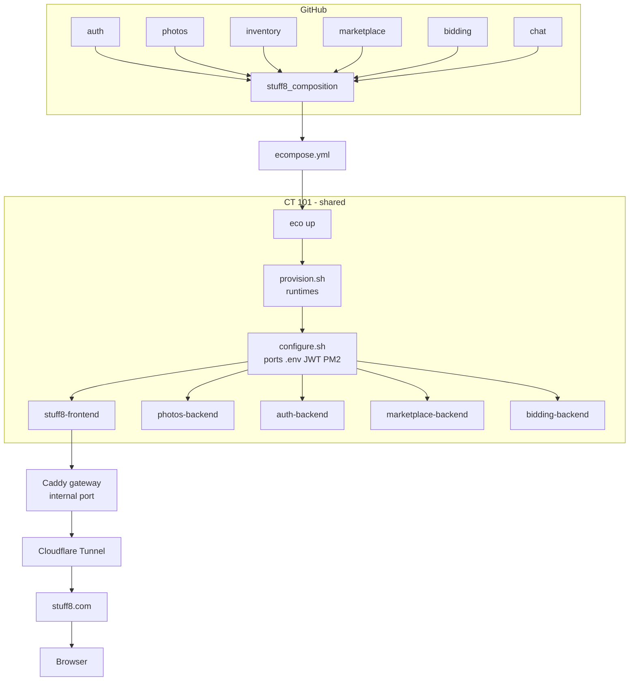
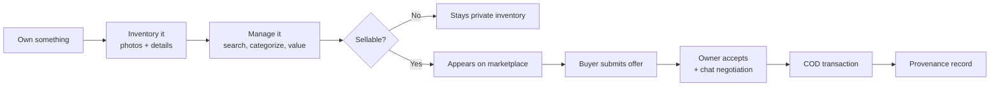

# Case Study: Stuff8

Stuff8 is a production estate built with eco — a **personal inventory system** whose inventory can optionally become a public marketplace. It demonstrates the full composition model: seven independent domains composed into one application, deployed on a shared CT, exposed through a single hostname.

> **Study the model, not the business.** This page uses Stuff8 to show how eco composes real, independent domains into a working estate.

## The composition

Stuff8 composes these domains (from `repos.json`):

| Domain | Role | Requires |
| --- | --- | --- |
| `auth` | Authentication system | — |
| `photos` | S3/MinIO media storage | auth |
| `inventory` | Personal asset management | auth, photos |
| `marketplace` | Public projection of sellable items | auth, inventory, photos, notifications |
| `bidding` | Offers, buyer selection, negotiation | auth, inventory, notifications |
| `chat` | Realtime conversations | auth, photos, notifications |
| `notifications` | In-app notifications + realtime | auth |
| `stuff8_composition` | Astro.js frontend | auth, photos, inventory, marketplace, bidding, notifications |

## Deployment flow

1. **Repos** — each domain lives in its own repository; `stuff8_composition` is the composition that pulls them together
2. **ecompose.yml** — declares the estate: CT 101, the nine domains, nine services, the `stuff8.com` hostname
3. **eco up** — provisions runtimes, clones domains, wires `.env` + ports + JWT, generates PM2 config, starts services
4. **Gateway** — Caddy routes `/` to the frontend, `/auth-api/*` to auth, `/api/*` to the backends
5. **Exposure** — Cloudflare Tunnel → proxy CT → gateway → services, all under one hostname

## Inventory-first user journey

Stuff8's differentiator is "Inventory First, Marketplace Second". The inventory is the source of truth; the marketplace is only a view.

- **Inventory is the source of truth** — marketplace is a filtered projection (`WHERE sellable = true`), never a duplicate
- **Selling is one click** — toggle `sellable`, the inventory item becomes a listing; no re-uploading photos or rewriting descriptions
- **Offers, not checkout** — buyers submit offers, owners accept/reject/negotiate in realtime chat
- **COD transactions** — the app connects buyers and sellers; payment happens offline
- **Provenance** — every SOLD records an ownership history entry

## What this estate demonstrates

- **Reusable domains** — `auth` and `photos` are not Stuff8-specific; they are composed into other estates too
- **Shared CT** — CT 101 hosts multiple estates, each with its own ports, `.env`, PM2 processes, and databases
- **One hostname** — external traffic is `stuff8.com`, with `photos.stuff8.com` as an `expose.additional` for the media backend
- **Webhook deploys** — push to `main` on any composed repo triggers an estate-wide redeploy

## Try it live

The estate is deployed at **https://stuff8.com**. `eco up` built it from the `stuff8_bootstrap` manifest and the composed domains above.
