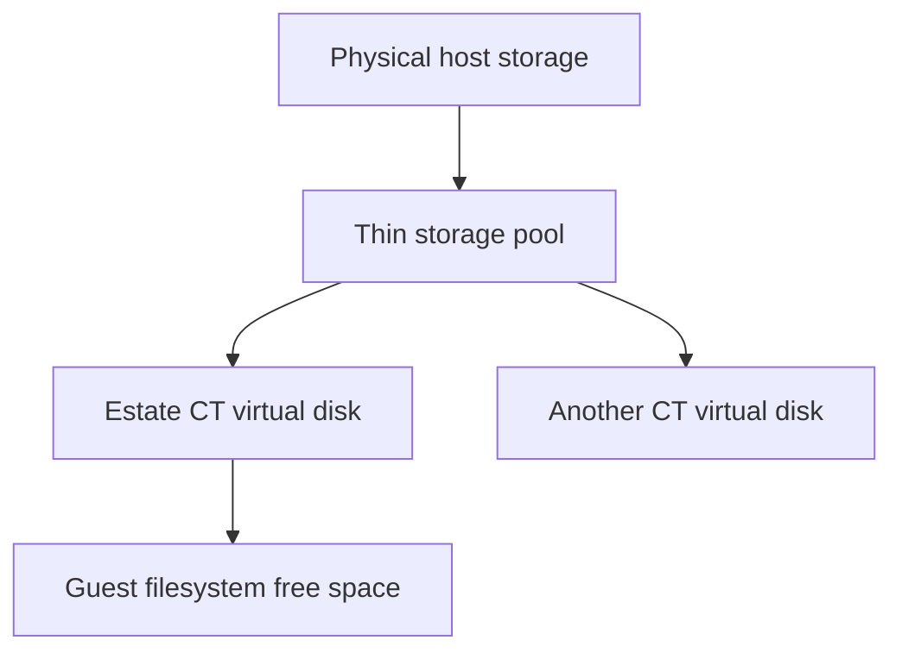

# What is Proxmox?

Eco is built on **Proxmox VE** (Proxmox Virtual Environment) — an open-source virtualization platform that serves as the machine foundation for every Eco estate.

## The short answer

Proxmox VE is a Debian-based operating system that turns a physical server into a virtualization host. It gives you a web UI and API to run two kinds of virtual machines:

- **QEMU/KVM VMs** — full virtual machines with their own kernel (like VirtualBox, but server-grade)
- **LXC Containers (CTs)** — lightweight OS-level virtualization that shares the host kernel (like a very efficient, thin container)

## How it's different — and special

### 1. Native, near-zero-overhead containers

Proxmox's LXC containers are **not Docker containers**. They run as normal processes on the host kernel, each with its own full userland (init, users, package manager, networking). Because there's no container daemon and no per-process overlay, CTs are:

- extremely fast to start and stop
- very light on memory (Eco's CTs run whole estates in 4 GB)
- predictable in resource use

This is exactly the "host-native" property Eco is built around: **services run as native processes inside a CT, not inside a container inside a CT.**

### 2. One CT is a full machine, not a process sandbox

A CT is a *machine* — it has its own filesystem, its own users, its own network interfaces, its own systemd. For Eco, the CT is the **machine boundary**:

```
+---------------------------------------------+
|  Proxmox host                               |
|  +-----------------+  +------------------+  |
|  | CT 101 (estate) |  | CT 102 (estate)  |  |
|  |  - stuff8.com   |  |  - another.com   |  |
|  |  - services     |  |  - services      |  |
|  |  - PM2          |  |  - PM2           |  |
|  +-----------------+  +------------------+  |
+---------------------------------------------+
```

Per-application isolation lives at this boundary — a whole application estate is one CT, and multiple estates can share one CT safely (different ports, `.env`, PM2 processes, databases).

### 3. Thin-provisioned storage has two capacity limits

Eco estates commonly use Proxmox thin storage: a CT receives a virtual disk
size, while the host allocates physical blocks only as the CT writes them. This
keeps early-stage estates economical, but it creates two different capacity
figures that operators must monitor:



- **Guest free space** is what `df` reports inside a CT. It determines whether
  that estate can create files on its virtual disk.
- **Thin-pool free space** is the host capacity shared by every CT using that
  pool. It determines whether Proxmox can satisfy new physical writes.

Those values can disagree. A CT may show free space after deleting build cache
or logs, while the shared thin pool remains nearly full because the reclaimed
blocks have not yet been discarded back to the host. At that point a later
write can fail even though the CT's own filesystem appears healthy.

The operational rule is simple: keep a headroom buffer at both layers. Eco's
deployment guard removes only safe, rebuildable cache when an estate is low on
guest space and stops before a deploy can fill its filesystem. That safeguard
does not replace host-level thin-pool monitoring, snapshots/backups, and
capacity planning.

### 4. First-class operations you'd have to build yourself elsewhere

Proxmox ships with operational features that, in Docker/K8s land, are separate products:

- **Snapshots** — freeze a CT state in one click, roll back anytime
- **Backups** — scheduled, deduplicated backups to any storage
- **Cloning + templates** — Eco provisions CTs from a prepared `Eco-npm-rust-mongo` template; new estates spin up in minutes
- **Clustering + live migration** — multiple Proxmox hosts form a cluster; CTs move between nodes with zero downtime
- **Resource quotas** — CPU, memory, disk, and network per CT
- **A real web UI + REST API** — Eco drives CT lifecycle through the Proxmox API

### 5. Built on proven open source

Proxmox is Debian + KVM + LXC + Ceph (for clustered storage) + ZFS — all battle-tested open-source components, glued together by a management layer that is itself open source. No licensing fees, no per-CT costs.

## Why Eco chose it

| Requirement | Why Proxmox wins |
| --- | --- |
| Cheap application-scale isolation | LXC CTs are nearly free; one host runs many estates |
| Reproducible environments | Eco provisions CTs from templates + `provision.sh` |
| Manageable by a CLI/API | Eco drives CT create/config through the Proxmox API |
| Agent-friendly iteration | CTs start/stop in seconds; no image pulls |
| Operational safety | snapshots, backups, clustering built in |
| Self-hosting, no lock-in | fully open source, runs on commodity hardware |

## Where it fits in Eco

- **`ecompose.yml → ct` block** — declares the CT (id, hostname, template, storage, CPU, memory)
- **`eco ct create`** — provisions the CT via the Proxmox API
- **`provision.sh`** — installs runtimes *inside* the CT, idempotently
- **`eco up`** — deploys the estate into the CT

The CT is the environment in the ecology: the habitat every estate lives in, and the boundary that makes "one estate = one isolated world" cheap enough to be the default.

See also: [Estates](/concepts/estates), [Scaling](/concepts/scaling), [Architecture](/reference/architecture).
