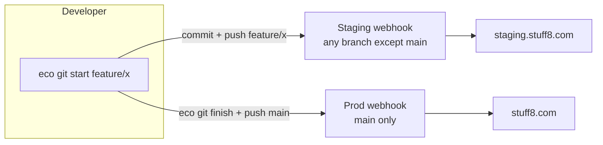

# Prod & Staging Workflow

Every Eco estate can have **two footprints**: a **production** site your users
actually visit, and a **staging** site where new work lands before it ever
touches production.

This is the daily working rhythm for a team building on Eco. It exists to make
one thing hard: accidentally deploying to production. Production deploys
should be deliberate, reviewed, and guarded — not the default outcome of
pushing code.

## The problem we're solving

Without staging, every push to `main` deploys straight to production. For a
solo builder that feels fast; for a team it is dangerous — one bad push and
the live site is down with no preview to catch it first.

Eco's answer is a **two-webhook model**:

- a push to a **feature branch** → deploys to **staging**
- a push to **`main`** → deploys to **production**

## Feature flow, not just git flow

Classic git flow is about *branch topology* — `develop`, `feature/*`,
`release/*`, hotfixes, and a strict merge ceremony. Teams that love it usually
find they actually want something simpler: **one feature at a time, visible on
a real site, then merged to main.**

Eco ships the pieces that matter:

| Command | What it does |
|---|---|
| `eco git start <name>` | Creates branch `<name>` from `origin/main` across **every repo** in the estate |
| `eco git commit -m "<msg>"` | Commits + pushes the current branch in every repo that has changes |
| `eco git push` | Pushes the current branch — a feature branch lands on **staging**, `main` lands on **prod** |
| `eco git finish <name>` | Merges the branch into `main` (after pulling latest main into it), **without pushing** |

The full loop:

```bash
eco git start feature/social-login     # branch across all estate repos
# ... write code, verify locally ...
eco git commit -m "feat: add social login"
eco git push                           # -> staging.stuff8.com
# ... test the feature live on staging ...
eco git finish feature/social-login    # merge into main (stays on main)
eco git push                           # -> stuff8.com (prod)
```

### Why `start` and `finish`

`eco git start` guarantees every domain repo is on the same branch, based on
the same `origin/main`. `eco git finish` handles the integration carefully:
it merges the latest `main` **into** the feature branch first, so any conflict
surfaces on the feature branch — never on `main`. Then it merges the branch
into `main` and leaves you there, without pushing. Pushing to prod is always
a separate, deliberate `eco git push`.

## The two footprints

An estate declares its staging footprint in `ecompose.yml`:

```yaml
deploy:
  github:
    enabled: true
    branch: main

staging:
  ct: 1000          # a second CT, separate from prod
```

`eco up` then provisions both:

| | Production | Staging |
|---|---|---|
| CT | `ct.id` | `staging.ct` |
| Hostname | `stuff8.com` | `staging.stuff8.com` |
| Webhook branch | `main` only | any branch except `main` |

> `eco startproject` asks for the staging CT up front (default `1000`), so
> every new estate gets staging from day one.



## Live example: Stuff8

Stuff8 runs both footprints today:

- **Production** — https://stuff8.com
- **Staging** — https://staging.stuff8.com

Push a feature branch and watch it appear on staging; merge to main and it
goes live on production.

## Guarding the road to production

Staging is the first guardrail: the code is running on a real server with
real data before it reaches users.

A second guardrail is coming: **automated integration testing plus thorough
application usage before any push to `main` is accepted.** This is not
implemented yet. The discipline it will enforce — "you don't push to prod
until the tests and the app itself pass" — is already the *intent* of this
workflow. Eco's Rust services already run `cargo test` before a webhook
deploy restarts anything; the broader estate-wide gate is on the roadmap.

## Sync prod data to staging

Staging is a real environment, and a real environment wants real data.
Eco can copy every database — **MongoDB and PostgreSQL** — from production to
staging in one command:

```bash
eco sync-staging
```

MongoDB streams `mongodump | mongorestore`; PostgreSQL streams
`pg_dump | pg_restore`. Both run CT-to-CT on the Proxmox host — nothing
round-trips to your laptop. Run it after a staging deploy so you're testing
against realistic data, not an empty database.

## Next

- [CI/CD — built in](/concepts/cicd) — how the webhooks and debounce work
- [ecompose.yml reference](/reference/ecompose) — the `deploy` and `staging` blocks
- [Stuff8 case study](/case-study/stuff8) — the estate these links point at
